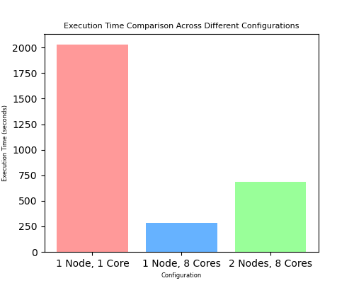

# Mastodon Data Analysis using SPARTAN Cluster

## Introduction
This report documents the process of analyzing a large Mastodon dataset using the SPARTAN high-performance computing (HPC) cluster. The task was to identify:
- The 5 happiest and saddest hours based on sentiment scores.
- The 5 happiest and saddest users based on cumulative sentiment scores.

The application was tested with different configurations on the SPARTAN cluster:
- **1 node, 1 core**
- **1 node, 8 cores**
- **2 nodes, 8 cores (4 cores per node)**

---

## Methodology

### Parallelization Approach
The application was implemented using `mpi4py`, a Python wrapper for the Message Passing Interface (MPI). The data was divided among processes, with each process handling a distinct chunk of the data file. The results were then aggregated to produce the final outputs.

- **Data Division**: 
    The input file, `mastodon-144g.ndjson`, was split into smaller chunks, each chunk being processed by a different MPI process. This approach ensures parallel reading and processing of the file, which reduces the overall execution time, especially when dealing with large datasets.
  
- **File Handling**: 
    Each process reads its assigned portion of the file by adjusting the file pointer (`f.seek(start_pos)`), ensuring no overlapping data is processed. 

- **Sentiment Analysis**: 
    The sentiment values in each post were extracted and processed. These values were associated with users and hours to compute sentiment scores:
    - **User Sentiment**: The total sentiment for each user (`account_id`, `username`) was calculated across all of their posts.
    - **Hour Sentiment**: Similarly, the total sentiment for each hour was computed.

- **Result Aggregation**: 
    After processing, the results from each MPI process (user and hour sentiment) were gathered using `comm.gather()`. The root process (rank 0) then combined these results and sorted them to determine the top 5 happiest and saddest users and hours.

### Key Insights

#### Top 5 Happiest Users
The users with the highest sentiment scores across all their posts are:

1. **gameoflife**, account id **110237351908820391** with a total sentiment score of **9105.74**
2. **TheFigen_**, account id **112728392129924952** with a total sentiment score of **2541.47**
3. **EmojiAquarium**, account id **113441357479871732** with a total sentiment score of **2086.46**
4. **choochoo**, account id **113541715572887376** with a total sentiment score of **1978.74**
5. **hnbot**, account id **110006430181118061** with a total sentiment score of **1917.79**


#### Top 5 Saddest Users
The users with the lowest sentiment scores across all their posts are:

1. **realTuckFrumper**, account id **109521050152429017** with a total sentiment score of **-9094.08**
2. **uavideos**, account id **109471254002284799** with a total sentiment score of **-5901.96**
3. **TheHindu**, account id **113443732887173058** with a total sentiment score of **-5710.72**
4. **uutisbot**, account id **111873606251312850** with a total sentiment score of **-4066.14**
5. **MissingYou**, account id **112071598249945636** with a total sentiment score of **-3341.60**

#### Top 5 Happiest Hours
The hours with the most positive sentiment, indicating times when posts tended to be more positive, are:

1. **2025-01-01 00:00-2025-01-01 01:00** with a total sentiment score of **206.15**
2. **2024-12-31 23:00-2024-12-31 24:00** with a total sentiment score of **187.47**
3. **2025-01-01 05:00-2025-01-01 06:00** with a total sentiment score of **135.93**
4. **2024-12-24 22:00-2024-12-24 23:00** with a total sentiment score of **117.29**
5. **2024-12-25 15:00-2024-12-25 16:00** with a total sentiment score of **114.60**


#### Top 5 Saddest Hours
Conversely, the hours with the most negative sentiment, highlighting times when posts tended to be more negative, are:

1. **2024-11-06 07:00-2024-11-06 08:00** with a total sentiment score of **-373.77**
2. **2024-09-11 01:00-2024-09-11 02:00** with a total sentiment score of **-305.58**
3. **2025-01-30 17:00-2025-01-30 18:00** with a total sentiment score of **-256.57**
4. **2025-01-30 18:00-2025-01-30 19:00** with a total sentiment score of **-226.91**
5. **2025-02-03 16:00-2025-02-03 17:00** with a total sentiment score of **-223.83**


### SLURM Job Submission
The application was submitted to the SPARTAN cluster via SLURM, with the configuration for each test determined from the command line to ensure the appropriate resource allocation:

  ```bash
    #SBATCH --time=01:00:00
    #SBATCH --job-name=anna(e)lisas_job
    #SBATCH --output=outputs-1n-1c/output.out
    #SBATCH --error=outputs-1n-1c/error.err

    ml GCCcore/11.3.0 Python/3.11.3 OpenMPI/4.1.4 mpi4py/3.1.4

    run_and_measure() {
        start=$(date +%s.%N)
        srun python3 -u analyse.py
        end=$(date +%s.%N)
        runtime=$(echo "$end - $start" | bc)
        echo "$runtime"
    }

    if [[ "$1" == "test_only" ]]; then
        srun --output=outputs/distributed_output.out python3 analyse.py &
        srun --ntasks=1 --nodes=1 --exclusive --output=outputs/non_distributed_output.out python3 run_non_distributed.py &
        wait 
        diff outputs/distributed_output.out outputs/non_distributed_output.out

    # NOTE: Only for running on the smaller files!
    elif [[ "$1" == "benchmark_only" ]]; then
        runtimes=()
        for i in {1..3}; do
            echo "Benchmark run $i..."
            runtime=$(run_and_measure)
            runtimes+=("$runtime")
            echo "Runtime $i: $runtime seconds"
        done

        avg=$(printf "%s\n" "${runtimes[@]}" | awk '{sum+=$1} END {print sum/NR}')
        echo "Average runtime over 3 runs: $avg seconds"

    else
        srun python3 -u analyse.py
    fi
  ```

The `test_only` and `benchmark_only` arguments were used exclusively with the two smaller test files. When using the  `test_only` flag, a script (`run_non_distributed.py`) designed to perform the same task in a non-distributed manner was executed alongside with the distributed script (`analyse.py`), and the outputs were compared. This comparison checks for any differences between the distributed job’s output (`distributed_output.out`) and the non-distributed job’s output (`non_distributed_output.out`), verifying if the parallelized version produces the same results.
With the two smaller files, we confirmed that the users and hours returned by both versions matched before proceeding to the larger file, where we could not perform the same comparison test.

The `benchmark_only` flag runs the same code three times, averaging the runtimes. We added this after running our analysis on the larger file to investigate the differences in runtime. 

To run the code with the three different configurations, we executed the following commands (from within the ClusterAndCloud-1 folder).

- **1 Node, 1 Core:**

```bash
    sbatch --nodes=1 --ntasks=1 --ntasks-per-node=1 slurm.sh
```

- **1 Node, 8 Cores:**

```bash
    sbatch --nodes=1 --ntasks=8 --ntasks-per-node=8 slurm.sh
```

- **2 Nodes, 8 Cores:**

```bash
    sbatch --nodes=2 --ntasks=8 --ntasks-per-node=4 slurm.sh
```


---

## Results
The total execution time for the three jobs is 3004.74 seconds (≈50 minutes) distributed as follows.

| Configuration       | Execution Time (seconds) |
|---------------------|--------------------------|
| 1 Node, 1 Core      | 2031.83                  |
| 1 Node, 8 Cores     | 286.38                   |
| 2 Nodes, 8 Cores    | 686.53                   |

---

### Performance Comparison Graph
<div align="center">



</div>

---

## Analysis

### Observations
- Utilizing **8 cores on a single node** drastically reduced execution time compared to a **single core**, which shows that our code parallelized effectively.
- When splitting the task across **2 nodes**, the execution time increased compared to the single-node, 8-core setup. Our hypothesis was that this was likely due to communication overhead. While the 2 node, 8 core code ran for a little over two times as long as the code with 1 node and 8 cores, it still ran almost three times faster than the code with only a single worker.
To investigate this difference further we benchmarked our analysis on the smaller file, `mastodon-16m.ndjson`. For this we used the `benchmark_only` flag when executing the `slurm.sh` script from above with the same three resource configurations. The averaged runtimes can be seen below. Although we expected communication overhead to be even more pronounced on the small `mastodon-16m.ndjson` dataset because of the shorter compute time, the measured runtimes across the two 8-core configurations were actually very similar. We believe that this is likely because the total execution time is dominated by fixed costs, e.g. process initialization, file I/O, and MPI setup.

| Configuration       | Average Execution Time on 16m Dataset(seconds) |
|---------------------|------------------------------------------------|
| 1 Node, 1 Core      | 0.0466                                         |
| 1 Node, 8 Cores     | 0.0346                                         |
| 2 Nodes, 8 Cores    | 0.0353                                         |

### Relating to Amdahl’s Law
Amdahl's Law states that the speedup of a parallel program is limited by the portion of the program that cannot be parallelized. In our case:
- The near-ideal speedup (286.38s × 8[cores] = 2291.04s ≈ 2031.83s) observed with **8 cores on 1 node** suggests the program is efficiently parallelized.
- The lower performance when using **2 nodes** suggests communication overhead as a limiting factor, consistent with Amdahl’s Law.

---

## Conclusion
The analysis confirms the effectiveness of parallelization when using multiple cores on a single node. However, the performance degrades when using multiple nodes on the large dataset, likely due to communication overhead.


